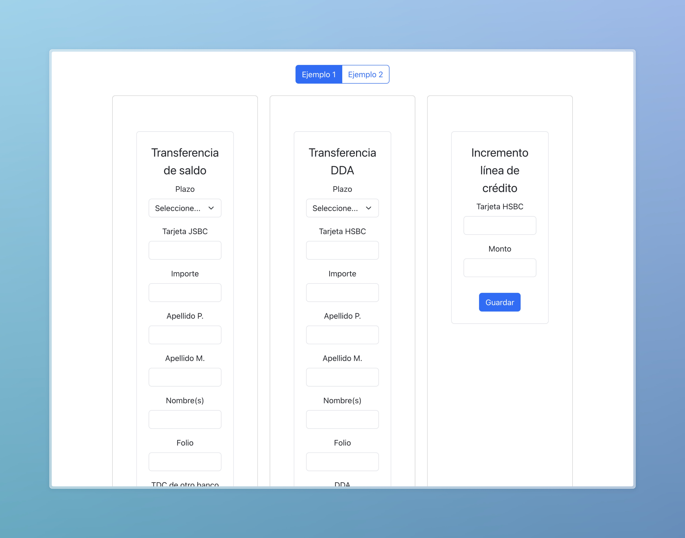
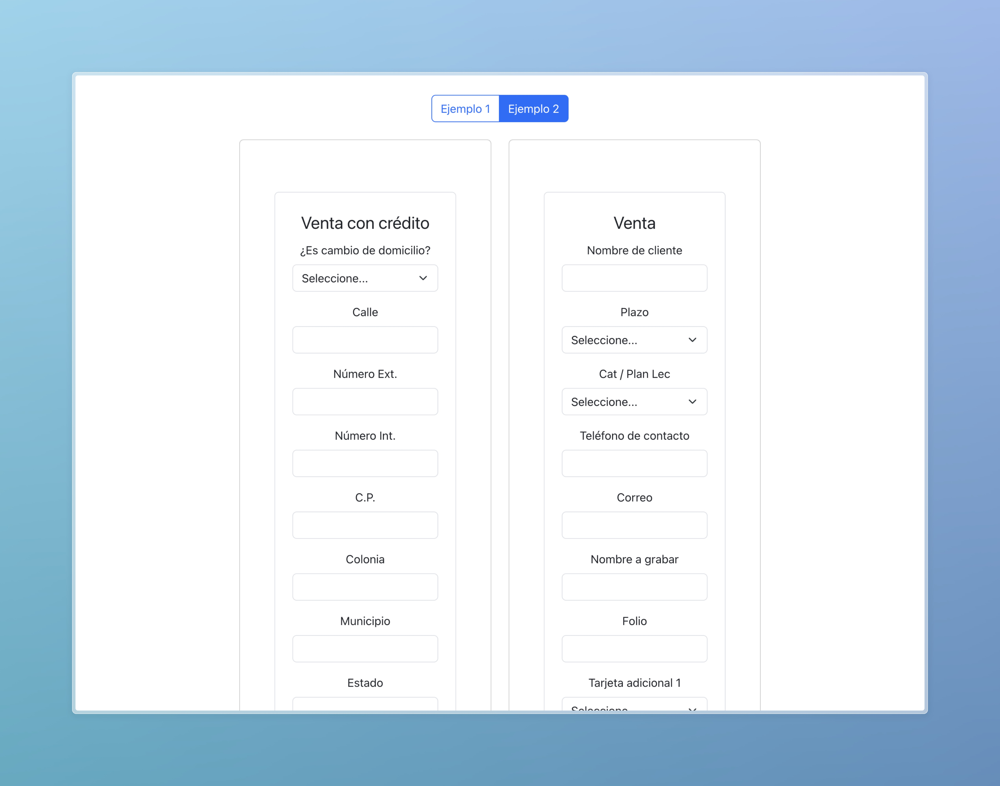

# 🧐 **Prueba Técnica**  
Genera formularios dinámicos basados en una definición en JSON. Este proyecto permite personalizar y validar formularios con lógica condicional para subformularios.

---

## 📖 **Requisitos Previos**  
Antes de comenzar, asegúrate de tener instalado lo siguiente:

- **Node.js**: [Descargar Node.js](https://nodejs.org) (versión 14 o superior recomendada).  
- **npm** o **yarn**: Administrador de paquetes incluido con Node.js.

---

## 🚦 **Instalación**  

### 1️⃣ **Clona el Repositorio**  
```bash
git clone https://github.com/Diego-Heredia/Prueba-Voices.git
cd Prueba-Voices
```

### 2️⃣ **Instala las Dependencias**  
Usa **npm** o **yarn** para instalar las dependencias del proyecto:  
```bash
# Con npm
npm install

# Con yarn
yarn install
```

---

## 🚀 **Ejecución**  

### 💻 **Modo Desarrollo**  
Ejecuta el proyecto:  
```bash
# Con npm
npm run dev

# Con yarn
yarn dev
```  
Abre tu navegador en [http://localhost:5173](http://localhost:5173) para ver la aplicación en acción.  

---

## 🧑‍🍳 **Características**  
- **Formularios Dinámicos:** Generación de formularios a partir de definiciones JSON.  
- **Lógica Condicional:** Renderizado de subformularios basados en las respuestas del usuario.  
- **Validación de Formularios:** Manejo y validación de entradas con **React Hook Form**.  
- **Diseño Responsivo:** Interfaz adaptable gracias a **Bootstrap**.  

---

## 📂 **Estructura del Proyecto**  

```plaintext
├── public/                  # Archivos públicos (favicon, index.html)
├── src/
│   ├── components/          # Componentes reutilizables (e.g., DynamicForm.jsx)
│   ├── data/                # JSONs de definición de formularios
│   ├── App.jsx              
│   ├── main.jsx            
│── package.json             # Configuración del proyecto y dependencias
```


## 📖 **Tecnologías Utilizadas**  
- **React**: Biblioteca de JavaScript para construir interfaces de usuario.  
- **React Hook Form**: Manejo eficiente de formularios y validación.  
- **Bootstrap**: Framework CSS para diseño responsivo y estilizado rápido.  
- **Vite**: Herramienta moderna para desarrollo rápido y eficiente.  


## 📸 **Vista Previa**  
### Ejemplo 1:  
  

### Ejemplo 2:  


---